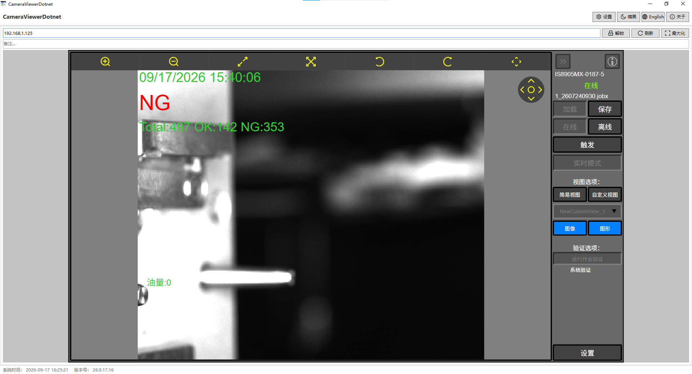

# CameraViewerDotnet

基于 .NET 8 的 WinForms 工业相机 HMI 网页查看器（复刻 CameraViewerTauri 核心功能），搭配 .NET Framework 4.8 启动器，解决工控机无 .NET 8 运行时无法运行的问题。最终分发为**单个便携式 exe**（内嵌 .NET 8 运行时安装包 + 主程序），不易被杀毒软件误删 DLL 导致无法启动。

## 截图



主界面：多路相机网格布局，每路格子内嵌 WebView2 加载工业相机 HMI 网页，支持 URL/备注编辑、锁定、刷新、最大化；顶部工具栏含设置、主题切换、语言切换、关于按钮；底部状态栏显示系统时间与版本号。

## 功能

- 1–16 路相机网格布局（1/2/4/6/9/16），WebView2 内嵌加载工业相机（康耐视 In-Sight 等）HTTP HMI 网页，URL 自动补 `http://` 前缀
- 错峰加载：第 i 路相机延时 i×N 秒（默认 10s，可配 0=立即）再加载，避免多路同时打开造成网络风暴
- 每路格子：URL / 备注编辑（失焦或回车即保存）、锁定（锁定后只读）、刷新、最大化/还原
- 设置窗口：相机显示（数量、错峰延时）、相机设置（每路 URL/备注/锁定）、显示设置（明亮/暗黑主题）、软件设置（中文/English）
- **JOBX 作业备份**：设置窗口「JOBX备份」标签页，配置 FTP 相机（名称/IP/端口/用户名/密码/备份目录），一键或全部备份；FTP/FTPS（默认启用，FTPS 才能正常备份 .jobx 文件）+ 信任自签证书；递归下载 `.jobx`/`.jobx.sig`；环形日志实时显示；备份目录支持点击「选择」按钮浏览（`FolderBrowserDialog`）
- **HMI 语言跟随**：WebView2 注入 `hmi-i18n.js`（`AddScriptToExecuteOnDocumentCreatedAsync`），在 `/pages/hmi/` 页面做整串文本替换中文化，语言跟随软件界面实时切换（`chrome.webview` 消息协议：子→宿主 `ready` 握手，宿主→子 `lang` 下发）
- **关于页面**：工具栏「关于」按钮，显示应用名/版本号（读取程序集 `InformationalVersion`）/功能描述/技术栈/GitHub 仓库链接
- URL/备注输入框水印提示（空内容时显示占位文本，语言切换同步刷新）
- 关闭按钮最小化到系统托盘（右键 显示界面/退出）
- 状态栏显示系统时间与版本号
- 配置 JSON 持久化，exe 旁放置 `portable.txt` 即启用便携模式（配置存 exe 旁 `Configs\`），否则存 `%LOCALAPPDATA%\CameraViewerDotnet\`

## 技术栈

| 部分 | 技术 |
|---|---|
| 主程序 `CameraViewer/` | .NET 8 WinForms，**纯 C# 实现（无 XAML）**，AntdUI 2.4.10（Ant Design 风格控件/无边框窗口/明暗主题），Microsoft.Web.WebView2，FluentFTP 50.1.0（JOBX 备份 FTP/FTPS） |
| 启动器 `CameraViewer.Launcher/` | .NET Framework 4.8（Win10 内置 .NET 4 即可运行），内嵌运行时安装包与主程序 exe 资源 |
| UI 风格 | AntdUI 控件 + VS Code 配色：暗黑 `#1e1e1e/#252526/#0e639c`，明亮 `#f0f0f0/#0078d4` |

启动器工作流程：检测 `Microsoft.WindowsDesktop.App 8.x`（`dotnet --list-runtimes`，PATH 与 `C:\Program Files\dotnet` 双路探测）→ 缺失则静默安装内嵌的 windowsdesktop-runtime-8.0.29 → 每次覆盖释放主程序到 `%LOCALAPPDATA%\CameraViewerDotnet\App\` 并启动。

## 构建

需要：.NET SDK 8+、MSBuild（Visual Studio 或 .NET Framework 4.8 自带）。

```bash
bash build-with-timestamp.sh
```

产物：`dist/CameraViewerDotnet_<yyyyMMddHHmm>.exe`（约 60MB 单文件，直接拷贝到工控机运行）。

## 部署注意事项

- 主程序显示相机网页依赖 **WebView2 运行时**；部分精简版 Win10 工控机可能缺失，首次运行需联网下载，或另行部署 WebView2 离线包(CognexVisionSuit会一起安装)
- 启动器内嵌 .NET 8 运行时安装包，工控机完全离线也能完成运行时安装
